<h1 align="center">
     
    Library Management System
     
</h1>

A full stack application using Spring Boot, Angular and MySQL. 
* This is a Library Management System with an Admin and a User side for the application. 
* Admin can perform CRUD with books/users. 
* User can borrow and return a book. 
* Uses JWT to authenticate login.
* Uses BCryptPasswordEncoder to encrypt the password stored in the database.
* Redirects to forbidden page if a role doesn't have access to the url.
 

# Screenshots

## Home & Login
### Home
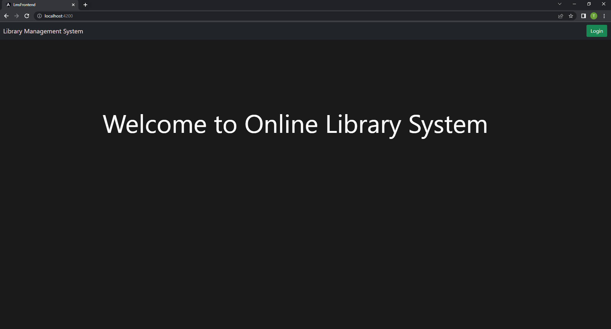

### Login
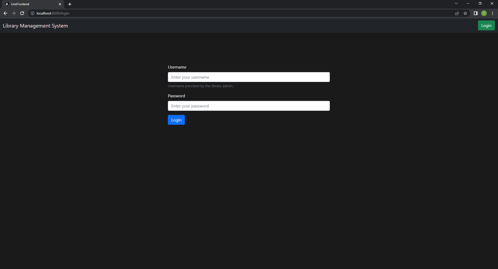

## Admin
### All books present
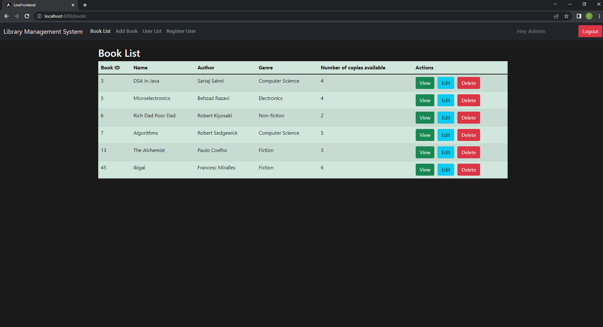

### Adding a book
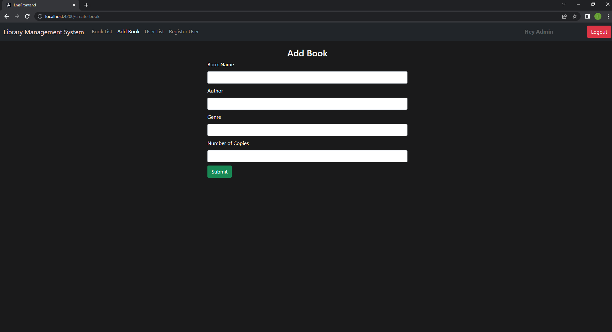

### Updating book details
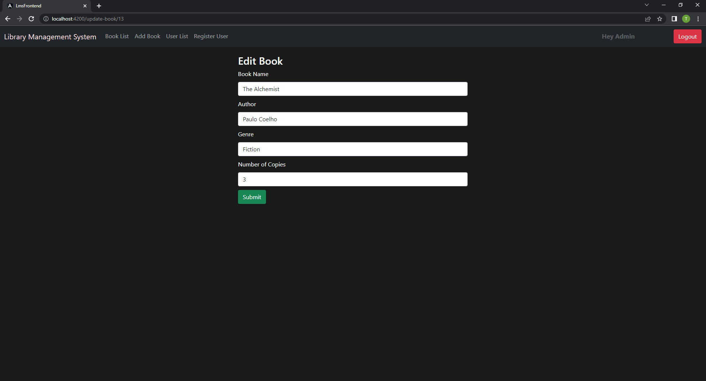

### Borrow history of a book
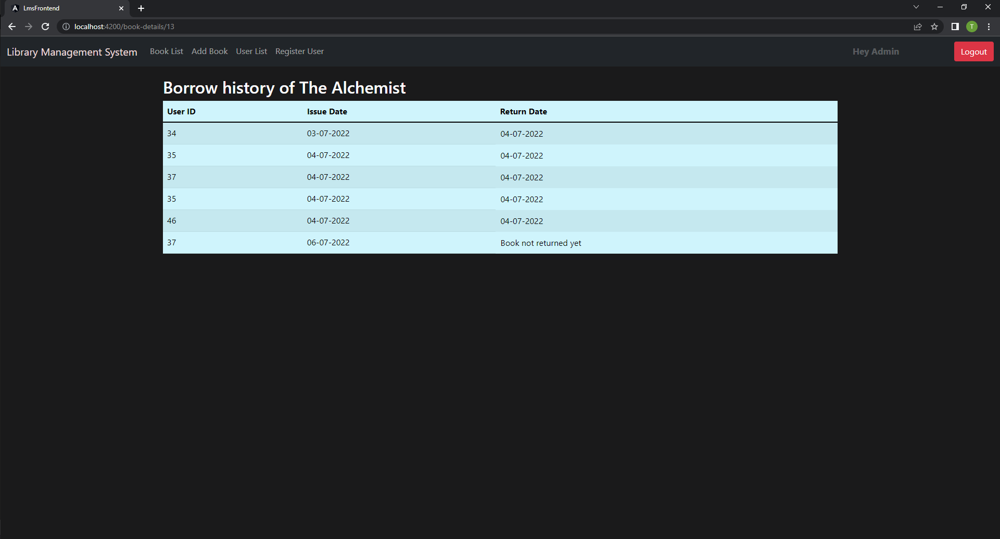

### All users present
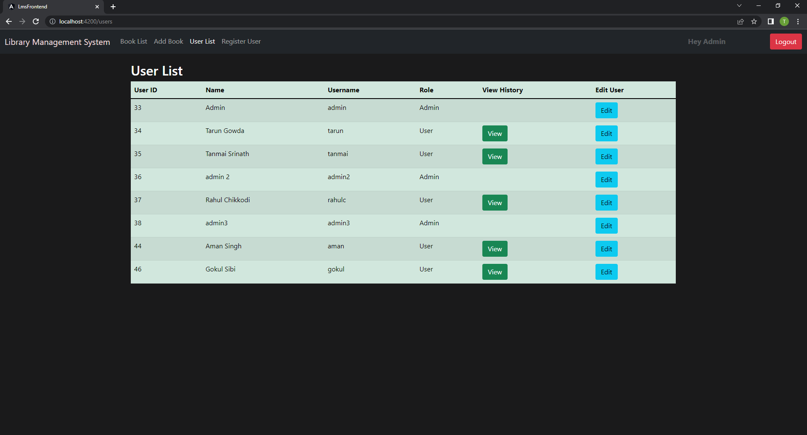

### Adding a user
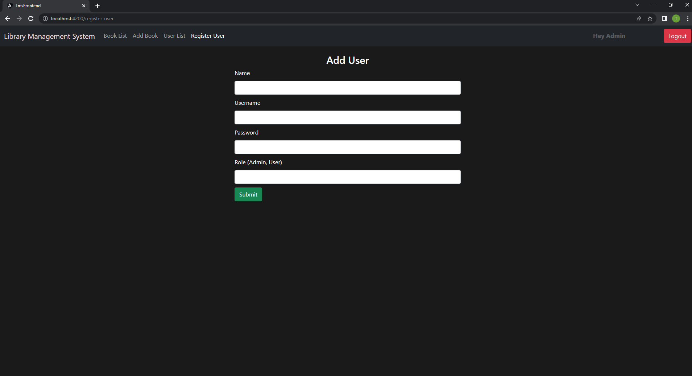

### Borrow history to the user
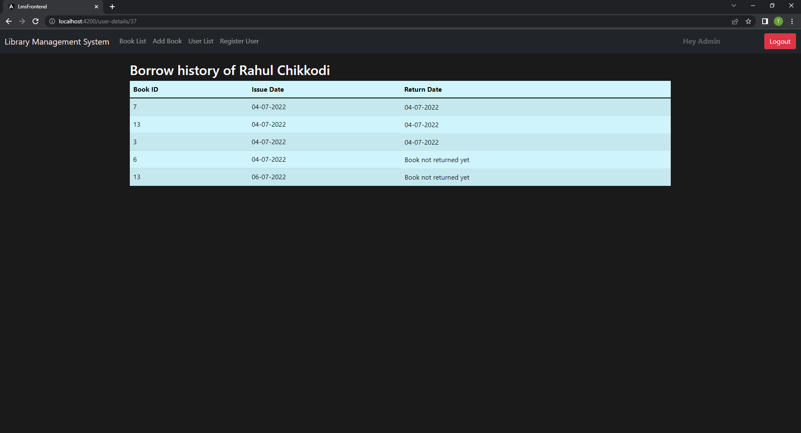

## User
### Borrow book
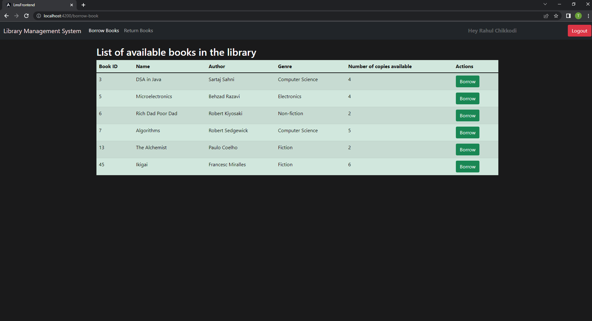

### Return book
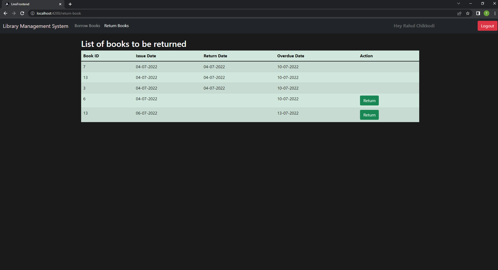

### Forbidden
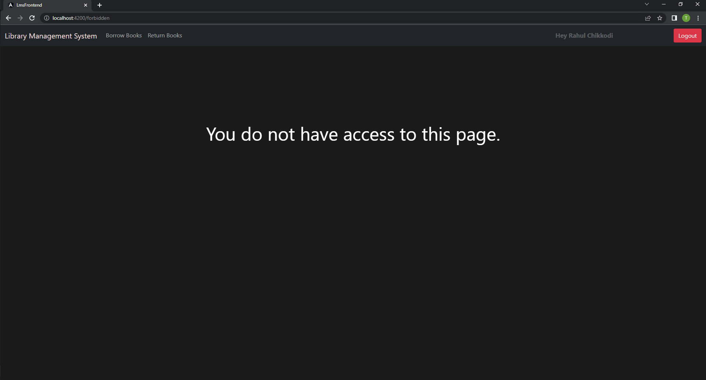

 
